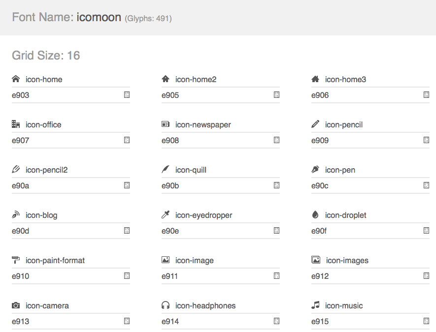
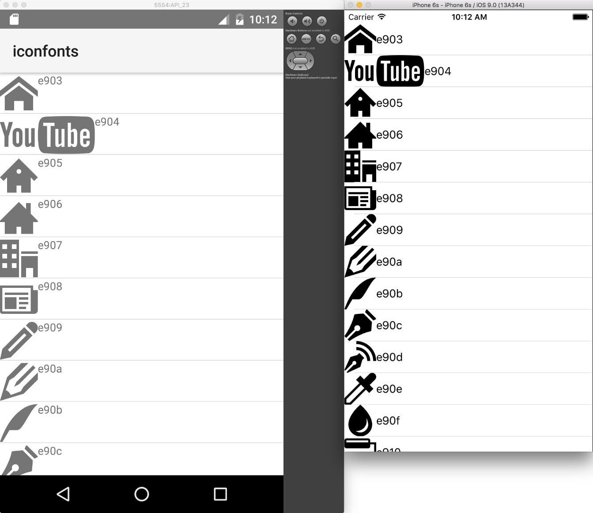

# Icon Fonts
While bitmap images are great, they present challenges in designing mobile applications. Images increase the size of the application if they are embedded in it. If not, they require additional http requests in order to be fetched. Images consume memory. Furthermore, bitmap images do not scale well. If scaled up, they will lose quality. If scaled down, they will waste space. On the other hand, fonts scale well, do not require additional http requests for each glyph and do not increase memory usage significantly. Icon fonts contain icons instead of alphabet characters and can be used instead of images in mobile applications.

# Using Icon Fonts in NativeScript
1. Choose or generate an icon font that best matches your needs. Two popular icon fonts are [IcoMoon](https://icomoon.io/) and [Font Awesome](https://fortawesome.github.io/Font-Awesome/).
2. Once you have downloaded the icon font to your machine, locate the [TrueType](https://en.wikipedia.org/wiki/TrueType) font file with extension **.ttf**.
3. In your NativeScript application **app** folder, create a folder called **fonts** and place the **.ttf** there.
4. Follow the instructions on the icon font webpage to determine the hex codes of each font glyph, i.e., icon. Add a **Label** component to your NativeScript app and bind the Label's **text** property to a one-letter string generated from the character code of the icon you want to show, i.e., `String.fromCharCode(0xe903)`.

> Do not forget to set the Label's **font-family** to the name of your font either through CSS, XML or code-behind.

## Icon Font


## Fonts Folder


## The Code

``` CSS
.icon {
   font-family: 'icomoon';
   font-size: 48;
}
```
``` XML
<Page xmlns="http://schemas.nativescript.org/tns.xsd" loaded="pageLoaded">
  <ListView items="{{ glyphs }}">
        <ListView.itemTemplate>
            <StackLayout orientation="horizontal">
                <Label text="{{ icon }}" class="icon"/>
                <Label text="{{ code }}" />
            </StackLayout>
        </ListView.itemTemplate>
    </ListView>
</Page>
```
``` JavaScript
"use strict";
var observable = require("data/observable");
function pageLoaded(args) {
    var page = args.object;
    var viewModel = new observable.Observable();
    var glyphs = new Array();
    var charCode = 0xe903;
    for (; charCode <= 0xeaea; charCode++) {
        var glyph = new observable.Observable();
        glyph.set("icon", String.fromCharCode(charCode));
        glyph.set("code", charCode.toString(16));
        glyphs.push(glyph);
    }
    viewModel.set("glyphs", glyphs);
    page.bindingContext = viewModel;
}
exports.pageLoaded = pageLoaded;
//# sourceMappingURL=main-page.js.map
```
``` TypeScript
import { EventData, Observable } from "data/observable";
import { Page } from "ui/page";

export function pageLoaded(args: EventData) {
    let page = <Page>args.object;
    let viewModel = new Observable();
    let glyphs = new Array<Observable>();
    var charCode = 0xe903;
    for(; charCode <= 0xeaea; charCode++){
        let glyph = new Observable();
        glyph.set("icon", String.fromCharCode(charCode));
        glyph.set("code", charCode.toString(16));
        glyphs.push(glyph);
    }
    viewModel.set("glyphs", glyphs)
    page.bindingContext = viewModel;
}
```





And the result is:




Here you can find the complete sample: [Icon Font Sample Application](https://github.com/NativeScript/icon-fonts)

