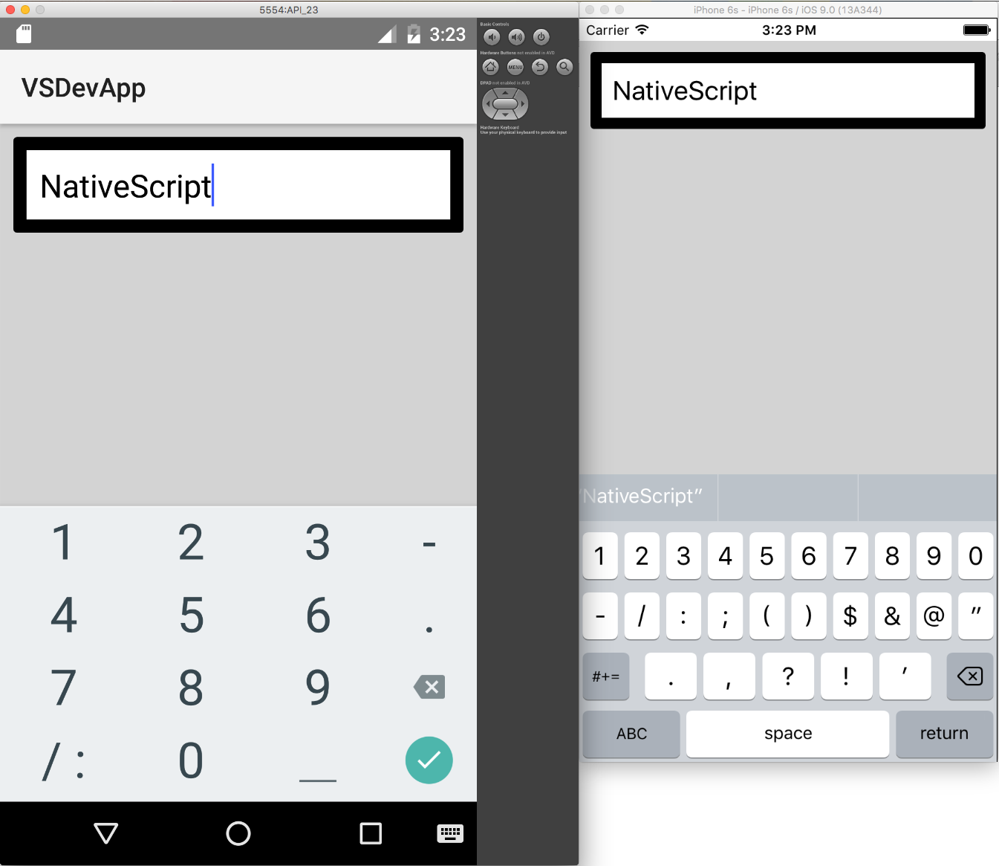
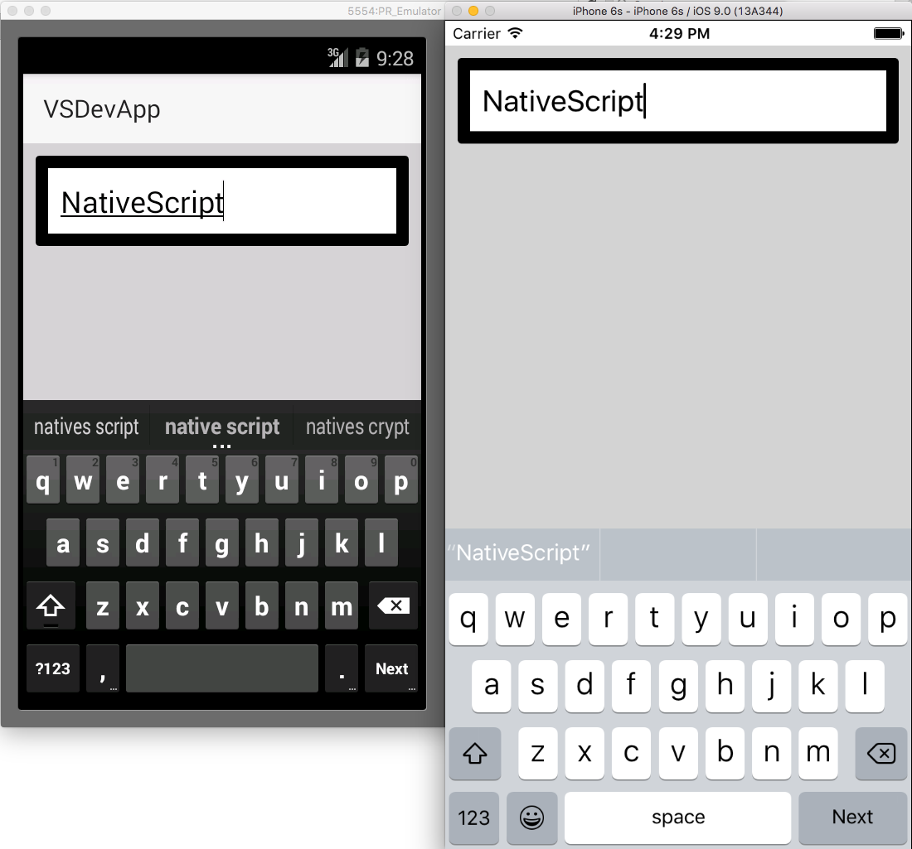
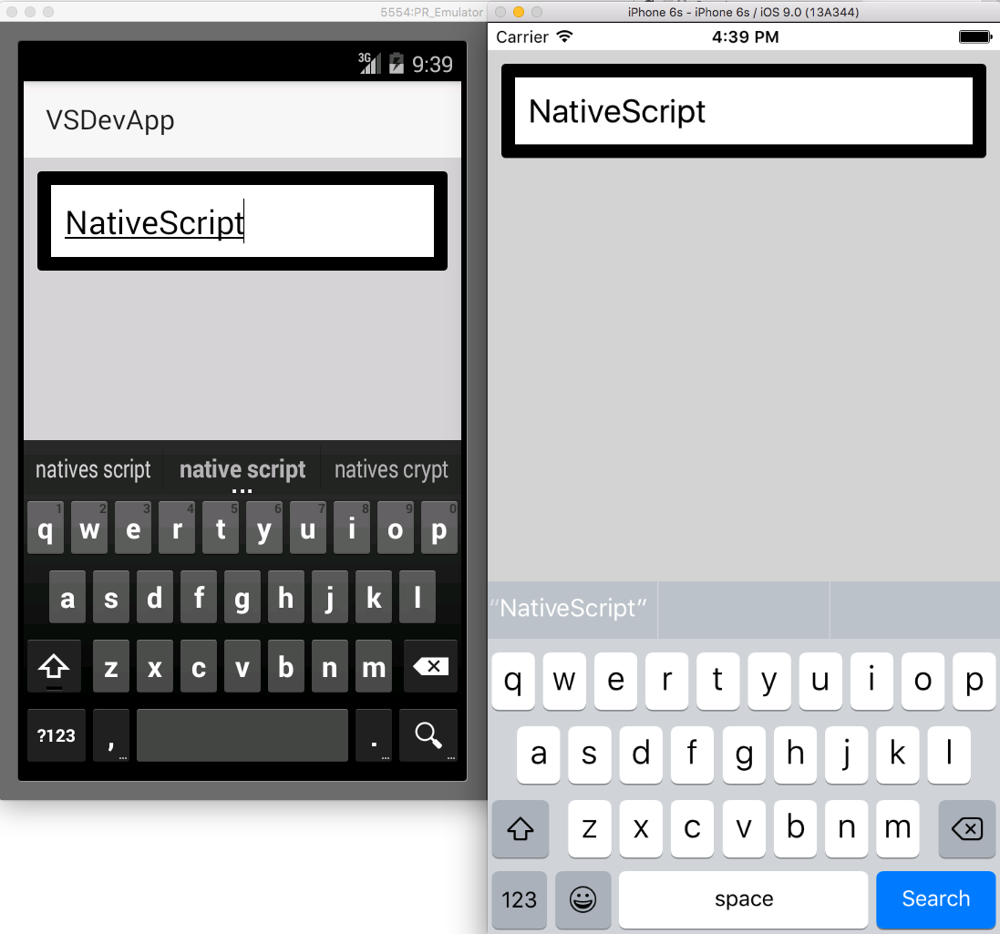

# Keyboard Type
All widgets that inherit from [`EditableTextBase`]({{site.baseurl}}/ApiReference/ui/editable-text-base/EditableTextBase.md), i.e. [`TextField`]({{site.baseurl}}/ApiReference/ui/text-field/TextField.md) and [`TextField`]({{site.baseurl}}/ApiReference/ui/text-view/TextView.md), have a **keyboardType** property which gets or sets the soft keyboard type that will be shown while in edit mode. Possible values are contained in the [`KeyboardType`]({{site.baseurl}}/ApiReference/ui/enums/KeyboardType/README.html) enumeration.

- datetime
 - Android: [TYPE_CLASS_DATETIME](http://developer.android.com/reference/android/text/InputType.html#TYPE_CLASS_DATETIME) | [TYPE_DATETIME_VARIATION_NORMAL](http://developer.android.com/reference/android/text/InputType.html#TYPE_DATETIME_VARIATION_NORMAL)
 - iOS:  [UIKeyboardTypeNumbersAndPunctuation](https://developer.apple.com/library/ios/documentation/UIKit/Reference/UITextInputTraits_Protocol/index.html#//apple_ref/c/tdef/UIKeyboardType)
 - 
- phone
 - Android: [TYPE_CLASS_PHONE](http://developer.android.com/reference/android/text/InputType.html#TYPE_CLASS_PHONE)
 - iOS:  [UIKeyboardTypePhonePad](https://developer.apple.com/library/ios/documentation/UIKit/Reference/UITextInputTraits_Protocol/index.html#//apple_ref/c/tdef/UIKeyboardType)
 - 
- number
 - Android: [TYPE_CLASS_NUMBER](http://developer.android.com/reference/android/text/InputType.html#TYPE_CLASS_NUMBER) | [TYPE_NUMBER_VARIATION_NORMAL](http://developer.android.com/intl/es/reference/android/text/InputType.html#TYPE_NUMBER_VARIATION_NORMAL) | [TYPE_NUMBER_FLAG_SIGNED](http://developer.android.com/reference/android/text/InputType.html#TYPE_NUMBER_FLAG_SIGNED) | [TYPE_NUMBER_FLAG_DECIMAL](http://developer.android.com/reference/android/text/InputType.html#TYPE_NUMBER_FLAG_DECIMAL)
 - iOS:  [UIKeyboardTypeNumbersAndPunctuation](https://developer.apple.com/library/ios/documentation/UIKit/Reference/UITextInputTraits_Protocol/index.html#//apple_ref/c/tdef/UIKeyboardType)
 - 
- url
 - Android: [TYPE_CLASS_TEXT](http://developer.android.com/reference/android/text/InputType.html#TYPE_CLASS_TEXT) | [TYPE_TEXT_VARIATION_URI](http://developer.android.com/reference/android/text/InputType.html#TYPE_TEXT_VARIATION_URI)
 - iOS:  [UIKeyboardTypeURL](https://developer.apple.com/library/ios/documentation/UIKit/Reference/UITextInputTraits_Protocol/index.html#//apple_ref/c/tdef/UIKeyboardType)
 - 
- email
 - Android: [TYPE_CLASS_TEXT](http://developer.android.com/reference/android/text/InputType.html#TYPE_CLASS_TEXT) | [TYPE_TEXT_VARIATION_EMAIL_ADDRESS](http://developer.android.com/reference/android/text/InputType.html#TYPE_TEXT_VARIATION_EMAIL_ADDRESS)
 - iOS:  [UIKeyboardTypeEmailAddress](https://developer.apple.com/library/ios/documentation/UIKit/Reference/UITextInputTraits_Protocol/index.html#//apple_ref/c/tdef/UIKeyboardType)
 - 

# Return Key Type
All widgets that inherit from [`EditableTextBase`]({{site.baseurl}}/ApiReference/ui/editable-text-base/EditableTextBase.md), i.e. [`TextField`]({{site.baseurl}}/ApiReference/ui/text-field/TextField.md) and [`TextField`]({{site.baseurl}}/ApiReference/ui/text-view/TextView.md), have a **returnKeyType** property which gets or sets the soft keyboard return key type. Possible values are contained in the [`ReturnKeyType`]({{site.baseurl}}/ApiReference/ui/enums/ReturnKeyType/README.html) enumeration.

- done
 - Android: [IME_ACTION_DONE](http://developer.android.com/reference/android/view/inputmethod/EditorInfo.html#IME_ACTION_DONE)
 - iOS: [UIReturnKeyDone](https://developer.apple.com/library/ios/documentation/UIKit/Reference/UITextInputTraits_Protocol/index.html#//apple_ref/c/tdef/UIReturnKeyType)
 - 
- next
 - Android: [IME_ACTION_NEXT](http://developer.android.com/reference/android/view/inputmethod/EditorInfo.html#IME_ACTION_NEXT)
 - iOS: [UIReturnKeyNext](https://developer.apple.com/library/ios/documentation/UIKit/Reference/UITextInputTraits_Protocol/index.html#//apple_ref/c/tdef/UIReturnKeyType)
 - 
- go
 - Android: [IME_ACTION_GO](http://developer.android.com/reference/android/view/inputmethod/EditorInfo.html#IME_ACTION_GO)
 - iOS: [UIReturnKeyGo](https://developer.apple.com/library/ios/documentation/UIKit/Reference/UITextInputTraits_Protocol/index.html#//apple_ref/c/tdef/UIReturnKeyType)
 - 
- search
 - Android: [IME_ACTION_SEARCH](http://developer.android.com/reference/android/view/inputmethod/EditorInfo.html#IME_ACTION_SEARCH)
 - iOS: [UIReturnKeySearch](https://developer.apple.com/library/ios/documentation/UIKit/Reference/UITextInputTraits_Protocol/index.html#//apple_ref/c/tdef/UIReturnKeyType)
 - 
- send
 - Android: [IME_ACTION_SEND](http://developer.android.com/reference/android/view/inputmethod/EditorInfo.html#IME_ACTION_SEND)
 - iOS: [UIReturnKeySend](https://developer.apple.com/library/ios/documentation/UIKit/Reference/UITextInputTraits_Protocol/index.html#//apple_ref/c/tdef/UIReturnKeyType)
 - 
