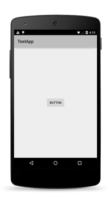
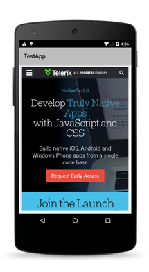
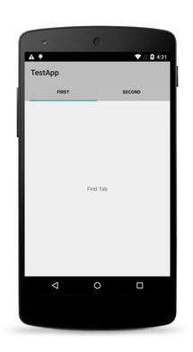

# User Interface Widgets

NativeScript ships with a set of user interface [`Views`]({{site.baseurl}}/ApiReference/ui/core/view/README.md) (also known as widgets) which you can use to build the user interface of a mobile application. Most of these views wrap the corresponding native view for each platform while providing a common API for working with it. For example the `Button` view renders an [`android.widget.Button`](http://developer.android.com/reference/android/widget/Button.html) on Android and [`UIButton`](https://developer.apple.com/library/ios/documentation/UIKit/Reference/UIButton_Class/) on iOS.

* [Button](#button)
* [Label](#label)
* [TextField](#textfield)
* [TextView](#textview)
* [SearchBar](#searchbar)
* [Switch](#switch)
* [Slider](#slider)
* [Progress ](#progress)
* [ActivityIndicator](#activityindicator)
* [Image](#image)
* [ListView](#listview)
* [HtmlView](#htmlview)
* [WebView](#webview)
* [TabView](#tabview)
* [SegmentedBar](#segmentedbar)
* [DatePicker](#datepicker)
* [TimePicker](#timepicker)
* [ListPicker](#listpicker)
* [Dialogs](#dialogs)

Defining the layout of the application is also an important part of the application development. For more information about the different layout containers that are available in NativeScript, see [The NativeScript Layout System]().

> **TIP:** You can access the underlying native widget for each view at runtime using the following properties.
>
> * Android: `<view>.android`
> * iOS: `<view>.ios`
>
> Accessing the native widgets might be useful when you want to use some platform-specific functionalities of the widget. You can find information about the underlying native component for each view below.

## Button

The [Button]({{site.baseurl}}/cookbook/ui/button) widget provides a standard button widget that reacts to a `tap` event.

**Native Component**

| Android               | iOS      |
|:----------------------|:---------|
| [android.widget.Button](http://developer.android.com/reference/android/widget/Button.html) | [UIButton](https://developer.apple.com/library/ios/documentation/UIKit/Reference/UIButton_Class/) |

## Label

The [Label]({{site.baseurl}}/cookbook/ui/label) widget provides a text label that shows read-only text.

**Native Component**

| Android               | iOS      |
|:----------------------|:---------|
| [android.widget.TextView](http://developer.android.com/reference/android/widget/TextView.html) | [UILabel](https://developer.apple.com/library/ios/documentation/UIKit/Reference/UILabel_Class/) |

## TextField

The [TextField]({{site.baseurl}}/cookbook/ui/text-field) widget provides an editable **single-line** text field.

**Native Component**

| Android               | iOS      |
|:----------------------|:---------|
| [android.widget.EditText](http://developer.android.com/reference/android/widget/EditText.html) | [UITextField](https://developer.apple.com/library/ios/documentation/UIKit/Reference/UITextField_Class/) |

## TextView

The [TextView]({{site.baseurl}}/cookbook/ui/text-view) widget provides an editable **multi-line** text view. 

You can use it to show multi-line text and implement text editing.

**Native Component**

| Android               | iOS      |
|:----------------------|:---------|
| [android.widget.EditText](http://developer.android.com/reference/android/widget/EditText.html) | [UITextView](https://developer.apple.com/library/ios/documentation/UIKit/Reference/UITextView_Class/) |

## SearchBar

The [SearchBar]({{site.baseurl}}/cookbook/ui/search-bar) widget provides a user interface for entering search queries and submitting requests to search provider.

**Native Component**

| Android               | iOS      |
|:----------------------|:---------|
| [android.widget.SearchView](http://developer.android.com/reference/android/widget/SearchView.html) | [UISearchBar](https://developer.apple.com/library/ios/documentation/UIKit/Reference/UISearchBar_Class/) |

## Switch

The [Switch]({{site.baseurl}}/cookbook/ui/switch) widget provides a two-state toggle switch with which you can choose between two options.

**Native Component**

| Android               | iOS      |
|:----------------------|:---------|
| [android.widget.Switch](http://developer.android.com/reference/android/widget/Switch.html) | [UISwitch](https://developer.apple.com/library/ios/documentation/UIKit/Reference/UISwitch_Class/) |

## Slider

The [Slider]({{site.baseurl}}/cookbook/ui/slider) widget provides a slider which you can use to pick a numeric value within a configurable range.

**Native Component**

| Android                | iOS      |
|:-----------------------|:---------|
| [android.widget.SeekBar](http://developer.android.com/reference/android/widget/SeekBar.html) | [UISlider](https://developer.apple.com/library/ios/documentation/UIKit/Reference/UISlider_Class/) |

## Progress

The [Progress]({{site.baseurl}}/cookbook/ui/progress) widget is a visual bar indicator of a progress in a operation. Shows a bar representing the current progress of the operation.

**Native Component**

| Android                | iOS      |
|:-----------------------|:---------|
| [android.widget.ProgressBar](http://developer.android.com/reference/android/widget/ProgressBar.html) (indeterminate = false) | [UIProgressView](https://developer.apple.com/library/ios/documentation/UIKit/Reference/UIProgressView_Class/) |

## ActivityIndicator

The [ActivityIndicator]({{site.baseurl}}/cookbook/ui/activity-indicator) widget is a visual spinner indicator which shows that a task is in progress.

**Native Component**

| Android                | iOS      |
|:-----------------------|:---------|
| [android.widget.ProgressBar](http://developer.android.com/reference/android/widget/ProgressBar.html) (indeterminate = true) | [UIActivityIndicatorView](https://developer.apple.com/library/ios/documentation/UIKit/Reference/UIActivityIndicatorView_Class/) |

## Image

The [Image]({{site.baseurl}}/cookbook/ui/image) widget shows an image. You can load the image can be from [`ImageSource`]({{site.baseurl}}/ApiReference/image-source/ImageSource.md) or from URL.

**Native Component**

| Android                | iOS      |
|:-----------------------|:---------|
| [android.widget.ImageView](http://developer.android.com/reference/android/widget/ImageView.html) | [UIImageView](https://developer.apple.com/library/ios/documentation/UIKit/Reference/UIImageView_Class/) |

## ListView

The [ListView]({{site.baseurl}}/cookbook/ui/list-view) shows items in a vertically scrolling list. You can set an [`itemTemplate`]{{site.baseurl}}/(ApiReference/ui/list-view/knownTemplates/README.md) to specify how each item in the list should be displayed.

**Native Component**

| Android                | iOS      |
|:-----------------------|:---------|
| [android.widget.ListView](http://developer.android.com/reference/android/widget/ListView.html) | [UITableView](https://developer.apple.com/library/ios/documentation/UIKit/Reference/UITableView_Class/) |

## HtmlView

The [HtmlView]({{site.baseurl}}/cookbook/ui/html-view) represents a view with html content. Use this component instead WebView when you want to show just static HTML content.

**Native Component**

| Android                | iOS      |
|:-----------------------|:---------|
| [android.widget.TextView](http://developer.android.com/reference/android/widget/TextView.html) | [UILabel](https://developer.apple.com/library/ios/documentation/UIKit/Reference/UILabel_Class/) |

## WebView

The [WebView]({{site.baseurl}}/cookbook/ui/web-view) shows web pages. You can load a page from URL or by navigating back and forward.

**Native Component**

| Android                | iOS      |
|:-----------------------|:---------|
| [android.webkit.WebView](http://developer.android.com/reference/android/webkit/WebView.html) | [UIWebView](https://developer.apple.com/library/ios/documentation/UIKit/Reference/UIWebView_Class/) |

## TabView

With the [TabView]({{site.baseurl}}/cookbook/ui/tab-view) control, you can implement tab navigation.

**Native Component**

| Android                | iOS      |
|:-----------------------|:---------|
| [android.support.v4.view.ViewPager](http://developer.android.com/reference/android/support/v4/view/ViewPager.html) | [UITabBarController](https://developer.apple.com/library/ios/documentation/UIKit/Reference/UITabBarController_Class/) |

## SegmentedBar

With the [SegmentedBar]({{site.baseurl}}/cookbook/ui/segmented-bar) control, you can implement discrete selection.

**Native Component**

| Android                | iOS      |
|:-----------------------|:---------|
| [android.widget.TabHost](http://developer.android.com/reference/android/widget/TabHost.html) | [UISegmentedControl](https://developer.apple.com/library/prerelease/ios/documentation/UIKit/Reference/UISegmentedControl_Class/index.html) |

## DatePicker

With the [DatePicker]({{site.baseurl}}/cookbook/ui/date-picker) control, you can pick date.

**Native Component**

| Android                | iOS      |
|:-----------------------|:---------|
| [android.widget.DatePicker](http://developer.android.com/reference/android/widget/DatePicker.html) | [UIDatePicker](https://developer.apple.com/library/ios/documentation/UIKit/Reference/UIDatePicker_Class/index.html) |

## TimePicker

With the [TimePicker]({{site.baseurl}}/cookbook/ui/time-picker) widget, you can pick time.

**Native Component**

| Android                | iOS      |
|:-----------------------|:---------|
| [android.widget.TimePicker](http://developer.android.com/reference/android/widget/TimePicker.html) | [UIDatePicker](https://developer.apple.com/library/ios/documentation/UIKit/Reference/UIDatePicker_Class/index.html) |

## ListPicker

With the [ListPicker]({{site.baseurl}}/cookbook/ui/list-picker) widget, you can pick value from a list.

**Native Component**

| Android                | iOS      |
|:-----------------------|:---------|
| [android.widget.NumberPicker](http://developer.android.com/reference/android/widget/NumberPicker.html) | [UIPickerView](https://developer.apple.com/library/prerelease/ios/documentation/UIKit/Reference/UIPickerView_Class/index.html) |

## Dialogs

The [dialogs module]() lets you create and show dialog windows.

