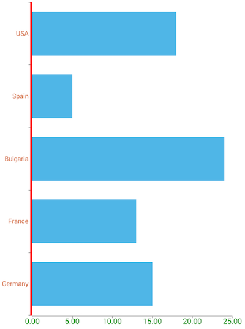

# Chart Axes Styling

If you followed the [axes overview]( "Chart Axes Overview") section, you know what type of axis is most suitable for the chart you need to created. This article will show you how to change the style of these axes including their lines, ticks and labels. 

* [Using Axis Properties](#using-axis-properties)
* [Styling with CSS](#styling-with-css)
* [Styling Axis Labels](#styling-axis-labels)
* [References](#references)

## Using Axis Properties

Styling the chart axes is done by using the corresponding customization properties exposed by the axes. [All axes]( "Chart Axes Overview") used in NativeScript UI Chart have the following properties:

-  - Determines the horizontal location of the axis if it is vertical. Can be one of the values of the  enum.
-  - Determines the vertical location of the axis if it is horizontal. Can be one of the values of the  enum.
-  - Determines the color of the axis' line.
-  - Determines the thickness of the axis' line.
-  - Determines whether the axis line is hidden.
-  - Determines the color of the axis' ticks
-  - Determines the length of the axis' ticks
-  - Determines the thickness of the axis' ticks
-  - Determines the offset of the axis' ticks relative to the axis.
-  - Determines whether the axis ticks are hidden.
-  - Determines the color of the axis' labels.
-  - Determines the text size of the axis' labels.
-  - Determines the format used to display the axis' labels. For example to format values to one symbol after decimal point and append the text `seconds`, you can use the following format: `%.1f seconds`.
-  - Determines the margin for the labels. The margin is a single number value and determines the number of device independent pixels between a label and its corresponding axis tick. 
-  - Determines the angle of rotation for labels. Used only when *labelFitMode* property has a value of .
-  - Determines the strategy used in attempt to fit the labels. The default value is  which means the labels are positioned on single line but there are  and  options too.
-  - Determines the layout mode for axis labels. With this property you can position labels in the  or  side of chart.

To better illustrate the usage of Axis properties, we will use a simple scenario in which the Axes are customized:

#### Example 1: Apply axis styles through component template

<snippet id='chart-styling-axes-vue'/>

This is how the chart looks like now:

#### Figure 1: Axis styles on Android (left) and iOS (right)

 

## Styling with CSS

All of the above properties can also be applied through [css](https://docs.nativescript.org/ui/styling). Here's how to apply the styles from the previous example through CSS:

#### Example 2: Apply axis styles through css
```CSS
LinearAxis {
    label-text-color: green;
    line-hidden: false;
    label-size: 10;
    line-thickness: 3;
    line-color: green;
}
CategoricalAxis {
    label-text-color: #cb4b16;
    label-size: 10;
    line-thickness: 3;
    line-color: red;
}
```

## Styling Axis Labels

Axis labels can be styled using the above label-related properties. Information about additional options for styling the labels of the axis in NativeScript UI Chart is available [here]( "Chart Axes Labels").

## References

Want to see this scenario in action?
Check our [SDK Examples](https://github.com/NativeScript/nativescript-ui-samples-vue) repository on GitHub. You will find this and many other practical examples with NativeScript UI.

Examples used in this article:

* [Customization Example](https://github.com/NativeScript/nativescript-ui-samples-vue/tree/master/chart/app/examples/axes/customization)

Related articles you might find useful:

* [**Axes Overview**]()
* [**Axes Labels**]()
* [**Series Overview**]()
