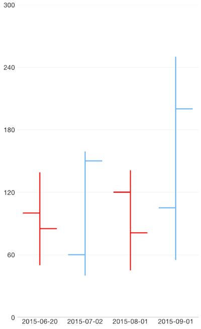

## Ohlc series: overview
This series operates with a special kind of data in the form of four parameters defining the stock market - open, high, low, and close. The high and low values show the price range (the highest and lowest prices) over one unit of time. The open and close values indicate the opening and closing price of the stock for the corresponding period. The width of the ohlc bar is determined by the period between 2 bars and the range of the axis

### Customization

To present a better view over OHLC series we will take a look at the following example:

### Example
Just like with all vue 'pages' let's start with the `Component` in which we will place our  instance.

Before that, we would create a basic JS or TS module that contains a collection of objects, which will be used by the chart to provide intuitive data visualization.

```
import { ObservableArray } from 'tns-core-modules/data/observable-array';

export const getFinantialData = () => {
  return new ObservableArray([
    { Date: '01/6/2015', Open: 100, Close: 85, Low: 50, High: 139 },
    { Date: '27/7/2015', Open: 60, Close: 150, Low: 40, High: 159 },
    { Date: '18/8/2015', Open: 120, Close: 81, Low: 45, High: 141 },
    { Date: '19/9/2015', Open: 105, Close: 200, Low: 55, High: 250 }
  ]);
};
```

All that is left is to declare the template of the vue component in which we:

- Declare a 
- Declare the  and  between the  open and close tags
- After that set the **`tkCartesianHorizontalAxis`** and **`tkCartesianVerticalAxis`** directive to the axes
- Finally declare a  instance to it, bind the  to the source of data and set the **`tkCartesianSeries`** directive

```
import { getFinantialData } from '../data';

export default {
  template: `
  <Page>
    <StackLayout>
      <RadCartesianChart>
        <OhlcSeries v-tkCartesianSeries
                    categoryProperty="Date"
                    openPropertyName="Open"
                    closePropertyName="Close"
                    highPropertyName="High"
                    lowPropertyName="Low"
                    :items="items" />
        <DateTimeCategoricalAxis v-tkCartesianHorizontalAxis
                                 dateFormat="yyyy-MM-dd"
                                 verticalLocation="Bottom"></DateTimeCategoricalAxis>
        <LinearAxis v-tkCartesianVerticalAxis></LinearAxis>
      </RadCartesianChart>
    </StackLayout>
  </Page>
  `,
  data () {
    return {
      items: getFinantialData(),
    };
  }
};
```

 
