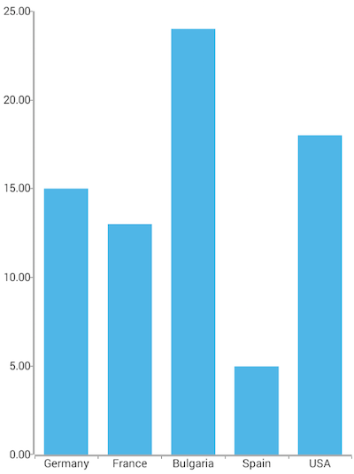
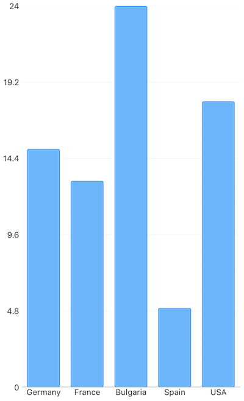

# RadChart Bar Series
Bar Series are categorical type of series that represent the objects from the data source as bars with different length. To use Bar series, you need to initialize a , define a  and  and bind the series to a set of data objects.

## Adjusting Bar Size
By default, the size of a bar is calculated based on the axis plot mode and the count of the categories from the data source. There are cases in which the automatically calculated size does not meet the specific application scenarios. By using the  and  properties you can adjust the size of a single bar within the series. The properties accept values in device independent pixels. These properties define boundaries for the size of a bar.

### Example
Just like with all vue 'pages' let's start with the `Component` in which we will place our  instance.

Before that, we would create a basic JS or TS module that contains a collection of objects, which will be used by the chart to provide intuitive data visualization.

```
import { ObservableArray } from 'tns-core-modules/data/observable-array';

export const getCountriesData = () => {
  return new ObservableArray([
    { Country: 'Germany', Amount: 15, SecondVal: 14, ThirdVal: 24, Impact: 0, Year: 0 },
    { Country: 'France', Amount: 13, SecondVal: 23, ThirdVal: 25, Impact: 0, Year: 0 },
    { Country: 'Bulgaria', Amount: 24, SecondVal: 17, ThirdVal: 23, Impact: 0, Year: 0 },
    { Country: 'Spain', Amount: 11, SecondVal: 19, ThirdVal: 24, Impact: 0, Year: 0 },
    { Country: 'USA', Amount: 18, SecondVal: 8, ThirdVal: 21, Impact: 0, Year: 0 }
  ]);
};
```

All that is left is to declare the template of the vue component in which we:

- Declare a 
- Declare the  and  between the  open and close tags
- After that set the **`tkCartesianHorizontalAxis`** and **`tkCartesianVerticalAxis`** directive to the axes
- Finally declare a  instance to it, bind the  to the source of data and set the **`tkCartesianSeries`** directive

```
import * as frameModule from 'tns-core-modules/ui/frame';
import { getCountriesData } from '../data';

export default {
  template: `
  <Page>
    <RadCartesianChart>
      <BarSeries v-tkCartesianSeries
                 categoryProperty="Country"
                 valueProperty="Amount"
                 :items="items" />
      <CategoricalAxis v-tkCartesianHorizontalAxis />
      <LinearAxis v-tkCartesianVerticalAxis />
    </RadCartesianChart>
  </Page>
  `,
  data () {
    return {
      items: getCountriesData(),
    };
  }
};
```

> Depending on the required Bar orientation, you can swap the axes' position and assign the  to the  property and the Linear to the  property. This will change the orientation of the bars to vertical.

 
