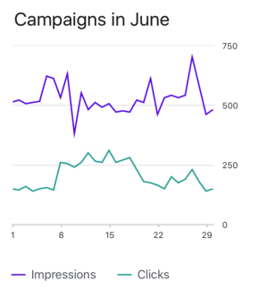

# Chart Overview

The NativeScript UI Chart is a charting component designed for the mobile environment. It offers great performance in loading time, drawing capabilities and real-time updates. Its intuitive object model and public API allow you to easily setup complex chart objects and integrate them into your application. The plugin provides two views that can be placed in a NativeScript layout -  - used to visualize (or plot) data on a cartesian coordinate system and  - used to visualize data in a way that resembles slices of a pie. An intuitive data binding mechanism transforms the raw data to appropriate data points. The plugin is distributed through the **nativescript-ui-chart** package on npmjs.

#### Figure 1: Some of the available chart series - LineSeries (left), DonutSeries (right) 

 

## Getting Started

[This article]( "Chart Getting Started") contains the basic steps to start using the nativescript-ui-chart plugin - how to create a list of items and visualize them with one of the available chart series and appropriate axes.

## Series

The series are one of the main components of the chart and determine how the data will be presented. The chart supports over 10 different series types, some of the most popular being BarSeries, LineSeries and PieSeries. [This article]( "Chart Series Overview") contains an overview of the different types and suggests the most appropriate depending on the data that has to be presented.

## Axes

When using Series that plot the data in Cartesian coordinates, the **RadCartesianChart** has to be used. It also requires two axes that determine what the horizontal and vertical coordinates represent. More information about the available axis types and examples for their usage is available in the [axes article]( "Chart Axes Overview").

## Grid

The RadCartesianChart can draw lines and stripes (the fill between the lines) behind the visualized series to illustrate better how the data relates to the values in the axes. This is controlled by the **RadCartesianChartGrid** which is demonstrated in [this article]( "Chart Grid").

## Annotations

The RadCartesianChart can also show linear and rectangular shapes over its series in order to annotate specific values on the chart. This can be achieved by adding instances of **ChartGridLineAnnotation** and/or **ChartPlotBandAnnotation**. These types are demonstrated in [this article]( "Chart Annotations").

## Trackball

The trackball is another feature availalbe for RadCartesianChart. When it is enabled users are able to display information about a point on the chart by hold and drag gesture. More information is available in [this article]( "Chart Trackball").

## Legend

Both RadCartesianChart and RadPieChart support adding a **RadLegendView** which will contain information about the presented series. In the context of RadCartesianChart, the legend will contain information about the different series, while in the context of RadPieChart it will contain information about the different slices for the presented series. More information is available in [this article]( "Chart Legend").

## Vue directives

When using the  and  with Vue you are going to work with multiple custom Vue RadChart specific directives. In short these directives are used by the Vue framework to enable 'linking' between separate HTML tags into one 'complex' element. As the ) and ( are composed by many elements (axes, series, legend, labels etc.) we have created an easy way of declaring for example an  as a simple standalone HTML tag and in order to 'link' it to its parent  you will only need to add the custom inline **`tkCartesianSeries`** directive.

Here is a full list of the available custom Vue  and  directives and components:

### Components
Represent the major elements:

| Selector          | Class (more details)                                  |
|-------------------|-------------------------------------------------------|
| RadCartesianChart |  |
| RadPieChart       |        |

### Directives
Represent the smaller elements that are visualized in  and :

| Selector          | Class (more details)                                  |
|-------------------|-------------------------------------------------------|
| RadLegendView |  |
| CategoricalAxis |  |
| LinearAxis |  |
| DateTimeCategoricalAxis |  |
| DateTimeContinuousAxis |  |
| LogarithmicAxis |  |
| LineSeries |  |
| AreaSeries |  |
| SplineSeries |  |
| SplineAreaSeries |  |
| BarSeries |  |
| RangeBarSeries |  |
| BubbleSeries |  |
| ScatterBubbleSeries |  |
| ScatterSeries |  |
| Palette |  |
| PieSeries |  |
| Donut Series |  |
| CandlestickSeries |  |
| OhlcSeries |  |
| RadCartesianChartGrid |  |
| ChartGridLineAnnotation |  |
| ChartPlotBandAnnotation |  |
| Trackball |  |
| PointLabelStyle |  |

### Inline Directives
Represent the 'link' mechanism of the smaller with the major elements. Note that for using the directive, you need to prefix the HTML attribute with a `v-` prefix. See [Vue.js directives](https://vuejs.org/v2/guide/custom-directive.html).

| Selector          | Class (more details)                                  |
|-------------------|-------------------------------------------------------|
| tkCartesianHorizontalAxis | Sets the horizontal axis of the RadCartesianChart |
| tkCartesianVerticalAxis | Sets the vertical axis of the RadCartesianChart |
| tkCartesianSeries | Sets the series of the RadCartesianChart |
| tkPieSeries | Sets the series of the RadPieChart |
| tkLineVerticalAxis | Sets the vertical axis of the LineSeries |
| tkLineHorizontalAxis | Sets the horizontal axis of the LineSeries |
| tkBarVerticalAxis | Sets the vertical axis of the BarSeries |
| tkBarHorizontalAxis | Sets the horizontal axis of the BarSeries |
| tkRangeBarVerticalAxis | Sets the vertical axis of the RangeBarSeries |
| tkRangeBarHorizontalAxis | Sets the horizontal axis of the RangeBarSeries |
| tkAreaVerticalAxis | Sets the vertical axis of the AreaSeries |
| tkAreaHorizontalAxis | Sets the horizontal axis of the AreaSeries |
| tkSplineVerticalAxis | Sets the vertical axis of the SplineSeries |
| tkSplineHorizontalAxis | Sets the horizontal axis of the SplineSeries |
| tkSplineAreaVerticalAxis | Sets the vertical axis of the SplineAreaSeries  |
| tkSplineHorizontalAxis | Sets the horizontal axis of the SplineAreaSeries |
| tkBubbleVerticalAxis | Sets the vertical axis of the BubbleSeries |
| tkBubbleHorizontalAxis | Sets the horizontal axis of the BubbleSeries |
| tkScatterBubbleVerticalAxis | Sets the vertical axis of the ScatterBubbleSeries |
| tkScatterBubbleHorizontalAxis | Sets the horizontal axis of the ScatterBubbleSeries |
| tkCandlestickVerticalAxis | Sets the vertical axis of the CandlestickSeries |
| tkCandlestickHorizontalAxis | Sets the horizontal axis of the CandlestickSeries |
| tkOhlcVerticalAxis | Sets the vertical axis of the OhlcSeriesSeries |
| tkOhlcHorizontalAxis | Sets the horizontal axis of the OhlcSeriesSeries |
| tkScatterVerticalAxis | Sets the vertical axis of the ScatterSeriesSeries |
| tkScatterHorizontalAxis | Sets the horizontal axis of the ScatterSeriesSeries |
| tkCartesianGrid | Sets the grid of the RadCartesianChart |
| tkCartesianPalette | Sets the palettes of the RadCartesianChart |
| tkCartesianPaletteEntry | Sets the entries of the Palette of the RadCartesianChart |
| tkPiePalette |  Sets the palettes of the RadPieChart |
| tkPiePaletteEntry | Sets the entries of the Palette of the RadPieChart |
| tkPieLegend | Sets the legend of the RadPieChart |
| tkCartesianLegend | Sets the legend of the RadCartesianChart  |
| tkCartesianTrackball | Sets the trackball of the RadCartesianChart  |
| tkCartesianAnnotations | Sets the annotations of the RadCartesianChart  |
| tkPieLabelStyle | Sets the labelStyle of the RadPieChart |
| tkDonutLabelStyle | Sets the labelStyle of the DonutSeries |
| tkLineLabelStyle | Sets the labelStyle of the LineSeries |
| tkBarLabelStyle | Sets the labelStyle of the BarSeries |
| tkAreaLabelStyle | {Sets the labelStyle of the AreaSeries |
| tkSplineLabelStyle | Sets the labelStyle of the SplineSeries |
| tkSplineAreaLabelStyle | Sets the labelStyle of the SplineAreaSeries |
| tkBubbleLabelStyle | Sets the labelStyle of the BubbleSeries |
| tkScatterBubbleLabelStyle | Sets the labelStyle of the ScatterBubbleSeries |
| tkCandlestickLabelStyle | Sets the labelStyle of the CandlestickSeries |
| tkOhlcLabelStyle | Sets the labelStyle of the OhlcSeries |
| tkScatterLabelStyle | Sets the labelStyle of the ScatterSeries |
